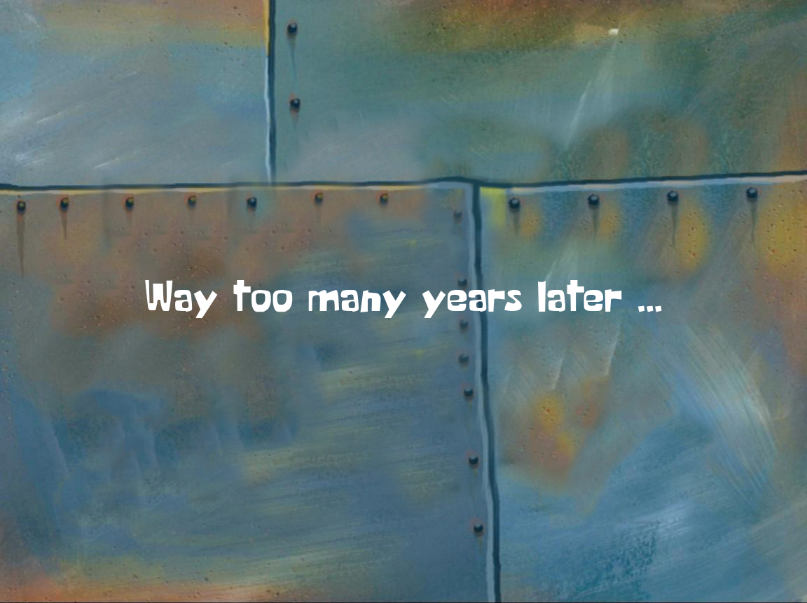
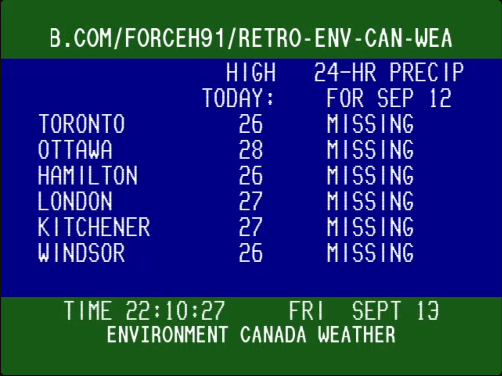
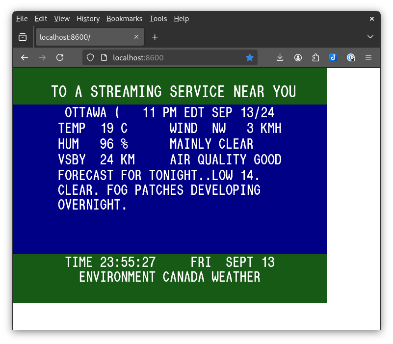

== Building the Container

We now have a system that can run docker containers and can be readhed from a
network. That just begs for it to do something. I have a `something` for it to
do.

Once upon a time...

Well, it was a long time ago, but back before all of the ISPs and readily
available internet (1980's and early 1990's), many people had a local community
cable info channel and some cable providers also had an Environment Canada
weather feed. I happen to miss that weather feed and that is what I want to
build a container to provide.

=== What prompted this?

Well, I once had a job at a local cable tv provider and I was hired to create a
Poc for a local advertising channel. They also had their own local community
news channel that did not use any special software. I was fascinated with it
and enjoyed workign there. I got to mess with some broadcast equipment, a title
generator, a frame caputure device, commercial video cameras, and a few other
odds and ends. They wanted me to go full time, but I thought I should do
something a little different



Many years later... I ran across a thread about  a guy who created a text
weather channel similar to the ones from the 1980's. Luckily, it was from
Winnipeg and it was a reasonably faithful representation of what I remembered.
I played with the software, but I was never really happy with it. I was going
to use it for a project to create a full set op local to my home TV channels
(more on that later), and I saw that due to the popularity, someone else built
software, but this time it sat on a web port and was viewable in a browser...

So we will build that in a docker container. We could just run the existing
container, but I think we can do better ourselves.

I have a fork of the project available and we will download it to the raspberry
Pi units and build ourselves a container. 

If you want to know what it looks like:




=== Getting the Information

So, let's get started. The first thing is to make sure you are logged in and in your  home directory.

Clone my repository

```
git clone https://github.com/scott5/retro-env-can-weather-chan.git
```

This should be pretty quick. Change into the repository

```
cd retro-env-can-weather-chan
```

Take a look around. We can discuss the files we care about right now.

* Dockerfile
* docker-compose.yml

In the `docker-compose.yml` file, we have a few bind mounts defined. They will
not work without the directories being present in the working directory, so we
need to create them before we can have the comtainer work.

```
mkdir cfg db music
```

We will talk about them shortly.

=== Building the Container

This part is pretty easy, but takes some time. We can cantinue the discussion
while this completes.

```
docker-compose up -d
```

And wait...

My compose session output:

```
Fri Sep 13 23:49:46 EDT 2024
[+] Building 795.4s (10/10) FINISHED                             docker:default
 => [envcan internal] load build definition from Dockerfile                0.1s
 => => transferring dockerfile: 753B                                       0.0s
 => [envcan internal] load metadata for docker.io/library/node:20-alpine   0.7s
 => [envcan internal] load .dockerignore                                   0.0s
 => => transferring context: 2B                                            0.0s
 => [envcan 1/6] FROM docker.io/library/node:20-alpine@sha256:2d07db07a2d  0.0s
 => CACHED [envcan 2/6] WORKDIR /root/retro-env-can-weather-chan           0.0s
 => CACHED [envcan 3/6] RUN apk add --no-cache git tini                    0.0s
 => CACHED [envcan 4/6] RUN git clone https://github.com/Forceh91/retro-e  0.0s
 => [envcan 5/6] RUN yarn install --network-timeout 600000 --frozen-loc  577.2s
 => [envcan 6/6] RUN yarn build:display && yarn cache clean               76.3s
 => [envcan] exporting to image                                          140.6s
 => => exporting layers                                                  140.5s
 => => writing image sha256:fa7f52df6e29b7e74e198abaa04ed0fe35a8051f53334  0.0s
 => => naming to docker.io/library/retro-env-can-weather-chan-envcan       0.0s
[+] Running 2/2
 ✔ Network retro-env-can-weather-chan_default     Created0.4s 
 ✔ Container retro-env-can-weather-chan-envcan-1  Started2.2s  
Sat Sep 14 00:03:05 EDT 2024
```

Assuming you were successful, you have constructed a container running a nodejs application on port 8600

```
project1:~/retro-env-can-weather-chan$ docker ps
CONTAINER ID   IMAGE                               COMMAND                CREATED         STATUS         PORTS                    NAMES
56d0bb6cf9da   retro-env-can-weather-chan-envcan   "tini -- yarn start"   4 minutes ago   Up 4 minutes   0.0.0.0:8600->8600/tcp   retro-env-can-weather-chan-envcan-1
project1:~/retro-env-can-weather-chan$ netstat -ant
Active Internet connections (servers and established)
Proto Recv-Q Send-Q Local Address           Foreign Address         State       
tcp        0      0 0.0.0.0:8600            0.0.0.0:*               LISTEN      
tcp        0      0 0.0.0.0:22              0.0.0.0:*               LISTEN      
tcp        0      0 :::22                   :::*                    LISTEN      
```

So point your laptop browser to the Pi at port 8600. You should have a
weather channel page running:



=== Configuration

If you append a /config to the URL, you will get some configuration pages. We
can discuss them at this point. You will want to do that, as well as make it
your own. It supports playing music as well, so I have a few pubblic domain,
royalty free jazz tracks we can test with. That will not be placed here for
anyone to find. I will have the link to the site in the reference list you will
see later.

=== Done

Congratulations, you have successfully built the app

