== Project Parts

Here are some suggested parts for the whole project, depending on how far you
want to go with this. The bare minimum for the first session will be:

* Raspberry Pi 3B (or better, but I think most of us have a 3B)
* A serial cable (several adapters are listed)
* A microSD card (8GB or better, class 10)
* A USB flash disk (16GB will be plenty)
* A sdcard reader (if you don't have one)

Now, if you want to see anything on the Pi HDMI output, you need a 1080p
monitor and a HDMI cable.

If you want to use a keyboard and mouse with the Pi, a USB keyboard and mouse
would be useful.

If you want to do the old school composite output, you will need the RCA
adapter with the 4 pole 3.5mm plug. Make sure you get one that is Pi
compatible, as there are variations.

This optional list goes on. You can decide after the first session. After
that, it is mostly software and use cases.

NOTE: The images used in this document are copied from the respective sites.
They may be subject to copyright, I do not know. They are present just in case
they change and I wanted to make sure they stayed the same for the duration,
so you would have at least an idea of what it is supposed to look like. I
don't know if there is any kind of copyright on them, I expect that some could
copyrighted, but this usage could be considered fair use, as they are
referencing the purchase location.

=== Amazon Parts List

The following are parts you can get from Amazon. I don't endorse any of them in
particular, I just picked these as meeting the requirements. I have many of
them in my collection of parts, but some of them may not be reliable,
specifically the USB to serial devices. I have had some fail in the past.

* https://www.amazon.ca/dp/B07ZGFG3NP[Kingston 64GB microSDXC Canvas]
image:parts/31qJ0ZLV3PL._SS135__564d5577b39b4c31a71d324f0bac41.jpg[Kingston
64GB microSDXC]
* https://www.amazon.ca/dp/B07D6LLX19[USB to TTL 5PIN Serial Converter 3.3V and 5V]
image:parts/51OWZhCXtZL._SS135__4ed6e31c6ccd45fa9f0a8186825e28.jpg[USB
to TTL 5PIN Serial Converter]
* https://www.amazon.ca/dp/B07WX2DSVB[USB to TTL UART Converter 5V 3.3V 2.5V 1.8V TTL]
image:parts/41Ac5ek3lFL._SS135__2dcf52a4787b491583bbe00c57a247.jpg[USB
to TTL UART Converter Cable]
* https://www.amazon.ca/dp/B08G1JNSWV[6ft 3.3V USB to TTL Serial Adapter]
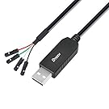
* https://www.amazon.ca/dp/B076DTWKBT[2 pcs Raspberry Pi USB to TTL Serial Cable]
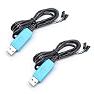
* https://www.amazon.ca/dp/B077Y149DL[SanDisk 16GB Ultra Fit USB 3.1 Flash Drive]
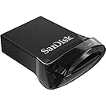
* https://www.amazon.ca/dp/B09FFK1QLR[SanDisk 32GB 3-Pack Flash Drive]
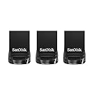
* https://www.amazon.ca/dp/B000KW6VJ2[CMPLE 3.5mm to 3 RCA Camcorder Video Audio Cable]
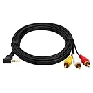
* https://www.amazon.ca/dp/B014I8SIJY[Amazon Basics HDMI Cable]
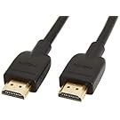
* https://www.amazon.ca/dp/B08G8QYFCD[Complete Starter Kit Raspberry Pi 3 Model B]
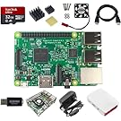
* https://www.amazon.ca/dp/B07D7P4SY4[Samsung BAR Plus 64GB]
image:parts/samsung_usb_flash_64gb.jpg[samsung-bar-plus-64gb,100,100]
* https://www.amazon.ca/dp/B07D7P4SY4[Samsung 64GB USB storage]
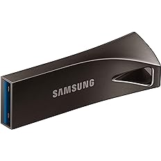
* https://www.amazon.ca/dp/B0C7GRCDD9[High-Speed Memory Card Reader 4in1 USB-C USB 3.0]
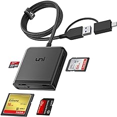

=== PiShop.ca Parts List

I also order from here a lot. I have not had a bad part yet, so I expect that
they verify the parts or use a better class of suppliers. The prices tend to be
a little higher and there are additional shipping charges.

* https://www.pishop.ca/product/pl2303hx-usb-to-rs232-ttl-converter-cable-module[PL2303 USB to RS232 TTL Converter Cable Module]
image:parts/apif60apz__39874.1554984210_db031639d7f148a6bc3254.jpg[USB TTL Cable,150,150]
* https://www.pishop.ca/product/5ft-cat6-ethernet-cable-black[5FT Cat6 Ethernet Cable]
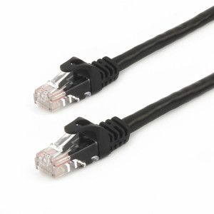
* https://www.pishop.ca/product/raspberry-pi-3-model-b-armv8-with-1g-ram[Raspberry Pi 3 - Model B - ARMv8 with 1G RAM]
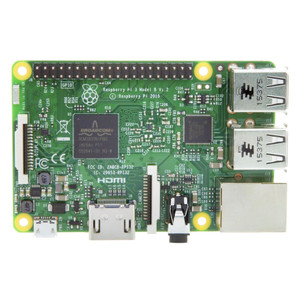
* https://www.pishop.ca/product/wall-adapter-power-supply-5-25v-dc-2-4a-usb-micro-b[Wall Adapter Power Supply - 5.1V DC 2.5A (USB Micro-B)]
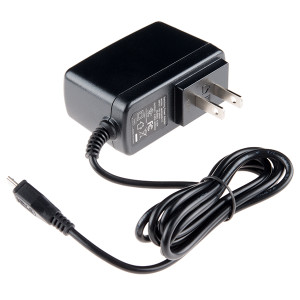
* https://www.pishop.ca/product/official-raspberry-pi-b23-case[Official Raspberry Pi Case&#44; White and Red (B+&#44; 2&#44; 3B&#44; 3B+)]
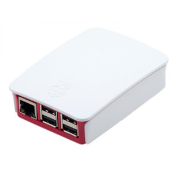
* https://www.pishop.ca/product/optical-mouse[Optical Mouse]
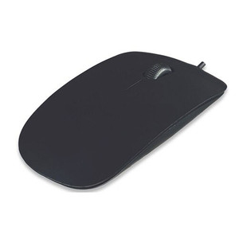
* https://www.pishop.ca/product/hdmi-cable-flat-1m[HDMI Cable - Flat - 1M]
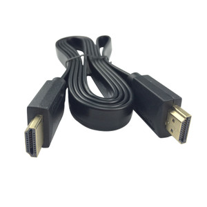
* https://www.pishop.ca/product/usb-console-stub-serial-adaptor-for-raspberry-pi[USB Console Stub - Serial adaptor for Raspberry Pi]
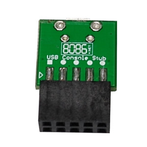
* https://www.pishop.ca/product/usb-to-ttl-4-pin-wire[USB to TTL 4-pin
Wire]
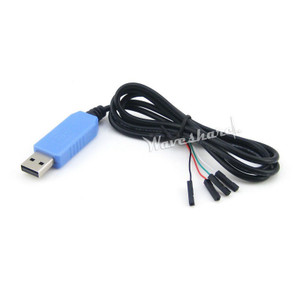
* https://www.pishop.ca/product/microsd-card-extreme-32-gb-class-10-blank-1[MicroSD Card Extreme - 32 GB - Class 10 - BLANK]
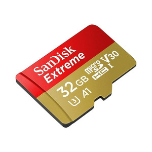
* https://www.pishop.ca/product/temporary-product-3[Adafruit Mini Chiclet Keyboard USB Wired Black]
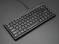
* https://www.pishop.ca/product/3-5mm-trrs-male-to-3rca-male-cable-nickel-plated[3.5mm TRRS Male to 3RCA Male Cable&#44; Nickel Plated]
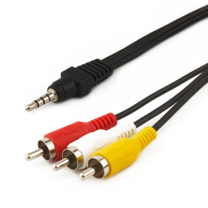
