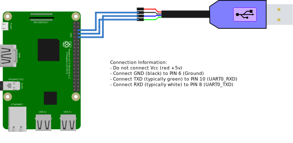

= Pi Serial Console

In order to use the Pi headless, we will need a serial console for the bulk of the workshop.

This is a pretty easy thing, as long as you have a USB to TTL
serial device. You need to connect the GND, TX and RX leads from the USB
device to the appropriate Pi GPIO pins. A full map is provided in the appendices.

The ones we are interested in are in the rightmost column if you look at the Pi
from above with the USB ports at the bottom. You will want to connect GND to
the third pin, RX to the fourth pin, and TX to the fifth pin. If you understand
the pin layout, these are pins 6,8,10 on the Pi. 

NOTE: Do not connect the Vcc wire (red). 

Depending on the device, your TX and RX
wires are going to be different colours, but GND is usually black. The others
can be green, blue, or  white on most devices. The order is not important, as you
can flip them if the do not work and try again. If you received documentation
with it, follow that layout.

The picture below shows the connectivity. 

